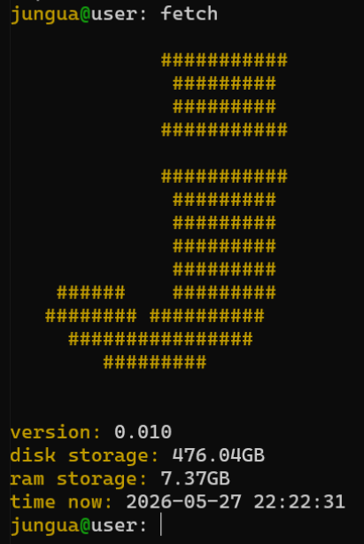
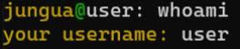
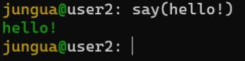
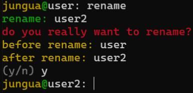

# jungua
cli-оболочка или же самодельная командная строка на python.

# команды
## fetch-
вывод лого командной строки,

версии командной строки jungua,

общее место на диске,

общее место на оперативной памяти,

время когда была выполнена команда fetch.

## whoami-
вывод имени пользователя, которое было заданно им в начале работы с jungua.

## exit- 
выход из командной строки jungua.
## say(текст)-
выводит текст написанный юзером в скобках.

## rename-
позволяет изменить текущее имя на другое.

## clear/cls
очищает командную строку.

# python
##  [0020.exe](files/versions/exe/0020.exe)
готовый python файл для запуска скомпилированный в .exe
##  [scr0020.py](files/versions/scripts/scr0020.py)
скрипт python для изучения программы.

# C
##  [0020.exe](files/versions/C/exec/0020.exe)
готовый C файл для запуска скомпилированный в .exe
##  [scr00020.c](files/versions/C/scripts/scr00020.c)
скрипт C для изучения программы.
