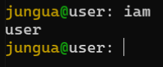

## jungua
cli-оболочка или же самодельная командная строка на python.
## команды
# fetch-
вывод лого командной строки,
версии командной строки jungua
общее место на диске,
общее место на оперативной памяти,
время при выполнении команды fetch.

# iam-
вывод имени пользователя, которое было заданно им в начале работы с jungua.

